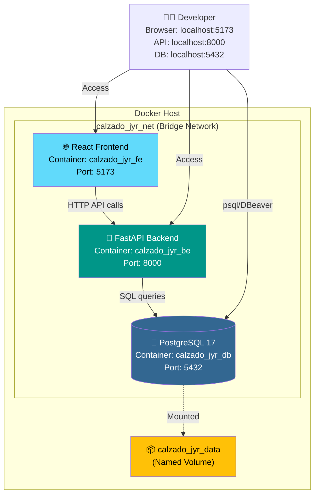
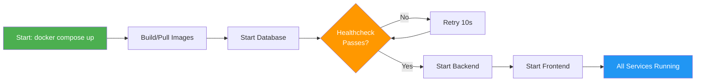

## Overview

CALZADO J&R follows a **3-tier architecture** orchestrated with Docker Compose, isolating database, backend, and frontend into independent containerized services that communicate over a private bridge network.

<CardGroup cols={3}>
  <Card title="Database Tier" icon="database" iconType="solid">
    PostgreSQL 17 Alpine
    
    Persistent storage with named volumes
  </Card>
  <Card title="Backend Tier" icon="server" iconType="solid">
    FastAPI + SQLAlchemy + Alembic
    
    RESTful API with JWT auth
  </Card>
  <Card title="Frontend Tier" icon="browser" iconType="solid">
    React 19 + Vite + TypeScript
    
    SPA with hot module replacement
  </Card>
</CardGroup>

---

## System Architecture Diagram



---

## Docker Compose Orchestration

The entire stack is defined in a single `docker-compose.yml` file at the project root. One command (`docker compose up -d`) launches all three services in the correct order with proper dependency management.

### Service Configuration

<AccordionGroup>
  <Accordion title="🐘 Database Service (db)" icon="database">
    **Image:** `postgres:17-alpine`
    
    **Why Alpine?** Minimal image size (~10 MB vs ~200 MB full variant) with same PostgreSQL functionality.
    
    **Key configurations:**
    
    ```yaml docker-compose.yml
    db:
      image: postgres:17-alpine
      container_name: calzado_jyr_db
      restart: unless-stopped
      
      environment:
        POSTGRES_USER: ${POSTGRES_USER}
        POSTGRES_PASSWORD: ${POSTGRES_PASSWORD}
        POSTGRES_DB: ${POSTGRES_DB}
      
      ports:
        - "${DB_PORT:-5432}:5432"
      
      volumes:
        - calzado_jyr_data:/var/lib/postgresql/data
        - ./db/init:/docker-entrypoint-initdb.d:ro
      
      healthcheck:
        test: ["CMD-SHELL", "pg_isready -U ${POSTGRES_USER} -d ${POSTGRES_DB}"]
        interval: 10s
        timeout: 5s
        retries: 5
        start_period: 15s
    ```
    
    **Health Check:** The `pg_isready` command ensures PostgreSQL is ready to accept connections before dependent services start. Without this, the backend might attempt to connect before the database is fully initialized.
    
    **Init Scripts:** SQL files in `./db/init/` are executed alphabetically on first container creation:
    - `01_create_tables.sql` - Creates tables, roles, and basic indexes
    - `02_triggers_and_indexes.sql` - Adds triggers for `updated_at` timestamps and partial indexes
  </Accordion>
  
  <Accordion title="🚀 Backend Service (be)" icon="server">
    **Build:** Multi-stage Dockerfile (`./be/Dockerfile`)
    
    **Target Stage:** `dev` (enables hot-reload with `--reload` flag)
    
    **Key configurations:**
    
    ```yaml docker-compose.yml
    be:
      build:
        context: ./be
        dockerfile: Dockerfile
        target: dev
      container_name: calzado_jyr_be
      restart: unless-stopped
      
      depends_on:
        db:
          condition: service_healthy
      
      environment:
        DATABASE_URL: postgresql://${POSTGRES_USER}:${POSTGRES_PASSWORD}@db:5432/${POSTGRES_DB}
        SECRET_KEY: ${SECRET_KEY}
        ALGORITHM: ${ALGORITHM:-HS256}
        ACCESS_TOKEN_EXPIRE_MINUTES: ${ACCESS_TOKEN_EXPIRE_MINUTES:-15}
        REFRESH_TOKEN_EXPIRE_DAYS: ${REFRESH_TOKEN_EXPIRE_DAYS:-7}
        FRONTEND_URL: ${FRONTEND_URL:-http://localhost:5173}
      
      ports:
        - "${BE_PORT:-8000}:8000"
      
      volumes:
        - ./be:/app
    ```
    
    **Why `condition: service_healthy`?** The backend waits for the database healthcheck to pass before starting. Using only `depends_on: - db` would start the backend as soon as the database container is running, which doesn't guarantee PostgreSQL has finished initialization.
    
    **Network Communication:** The `DATABASE_URL` uses `@db:5432` instead of `@localhost:5432` because services communicate by service name within the Docker network.
    
    **Hot Reload:** The volume mount `./be:/app` allows Uvicorn to detect code changes and restart automatically without rebuilding the image.
  </Accordion>
  
  <Accordion title="🌐 Frontend Service (fe)" icon="browser">
    **Build:** Multi-stage Dockerfile (`./fe/Dockerfile`)
    
    **Target Stage:** `dev` (Vite dev server with HMR)
    
    **Key configurations:**
    
    ```yaml docker-compose.yml
    fe:
      build:
        context: ./fe
        dockerfile: Dockerfile
        target: dev
      container_name: calzado_jyr_fe
      restart: unless-stopped
      
      depends_on:
        - be
      
      environment:
        VITE_API_URL: ${VITE_API_URL:-http://localhost:8000}
      
      ports:
        - "${FE_PORT:-5173}:5173"
      
      volumes:
        - ./fe:/app
        - /app/node_modules
    ```
    
    **Why the anonymous volume for `node_modules`?** When mounting `./fe:/app`, if `node_modules` doesn't exist on the host, Docker creates an empty directory that overwrites the `node_modules` installed during the image build. The anonymous volume `/app/node_modules` protects the installed dependencies from being overwritten.
    
    **Vite HMR:** Hot Module Replacement updates the browser in milliseconds when you save component files. No full page reload needed.
  </Accordion>
</AccordionGroup>

---

## Network Architecture

### Private Bridge Network

```yaml docker-compose.yml
networks:
  calzado_jyr_net:
    driver: bridge
```

**Purpose:** Isolates inter-service communication. The database is **not** accessible from the internet, only from services within the `calzado_jyr_net` network.

**Security principle:** Minimum privilege. External clients (browsers) can only reach the frontend on port 5173. The frontend makes API calls to the backend on port 8000. Only the backend can connect to the database.

<Note>
  **Port mapping vs. network communication:**
  - Port mappings like `5432:5432` expose ports to the host (your local machine)
  - Services communicate internally using service names: `db`, `be`, `fe`
  - In production, remove database port mapping to prevent external access
</Note>

---

## Volume Management

### Named Volume for Persistence

```yaml docker-compose.yml
volumes:
  calzado_jyr_data:
```

The `calzado_jyr_data` named volume stores all PostgreSQL data persistently.

**Behavior:**
- `docker compose down` - Stops containers but **preserves** data
- `docker compose down -v` - Stops containers and **deletes** all data (useful for reset)

**Location:** Docker manages the volume location (typically `/var/lib/docker/volumes/` on Linux).

<CodeGroup>
```bash Preserve data
# Normal shutdown - data persists
docker compose down

# Restart later - data is still there
docker compose up -d
```

```bash Reset database
# Delete ALL data including database contents
docker compose down -v

# Fresh start with empty database
docker compose up -d --build
```
</CodeGroup>

---

## Environment Configuration

### `.env` File Strategy

<Warning>
  **Never commit `.env` files to git.** The `docker-compose.yml` is versioned, but credentials go in `.env` which is in `.gitignore`.
</Warning>

All sensitive configuration is loaded from a `.env` file at the project root:

```bash .env.example
# Database
POSTGRES_USER=jyr_user
POSTGRES_PASSWORD=CHANGE_THIS_PASSWORD
POSTGRES_DB=calzado_jyr_db
DB_PORT=5432

# Backend
SECRET_KEY=GENERATE_WITH_COMMAND_BELOW
ALGORITHM=HS256
ACCESS_TOKEN_EXPIRE_MINUTES=15
REFRESH_TOKEN_EXPIRE_DAYS=7

# Frontend
VITE_API_URL=http://localhost:8000
FRONTEND_URL=http://localhost:5173
```

Generate a secure `SECRET_KEY`:

```bash
python -c "import secrets; print(secrets.token_urlsafe(48))"
```

---

## Service Dependencies



**Dependency order:**
1. Database starts first and runs healthcheck
2. Backend waits for database to be healthy
3. Frontend waits for backend to start (no healthcheck, just container running)

---

## Development Workflow

<Steps>
  <Step title="Clone repository">
    ```bash
    git clone <repository-url>
    cd calzado-jyr
    ```
  </Step>
  
  <Step title="Configure environment">
    ```bash
    cp .env.example .env
    # Edit .env with your values
    ```
  </Step>
  
  <Step title="Launch stack">
    ```bash
    docker compose up -d --build
    ```
    
    Watch logs:
    ```bash
    docker compose logs -f
    ```
  </Step>
  
  <Step title="Create admin user">
    ```bash
    docker compose exec be python scripts/create_admin.py
    ```
  </Step>
  
  <Step title="Access services">
    - Frontend: http://localhost:5173
    - Backend API: http://localhost:8000
    - API Docs: http://localhost:8000/docs
    - Database: localhost:5432
  </Step>
</Steps>

---

## Useful Commands

<CodeGroup>
```bash Service Management
# Start all services
docker compose up -d

# Stop all services (keep data)
docker compose down

# Restart a single service
docker compose restart be

# Rebuild after dependency changes
docker compose build be
docker compose up -d be
```

```bash Logs
# All services, follow mode
docker compose logs -f

# Single service
docker compose logs -f be

# Last 100 lines
docker compose logs --tail=100 db
```

```bash Shell Access
# Backend shell
docker compose exec be bash

# Database shell
docker compose exec db psql -U jyr_user -d calzado_jyr_db

# Frontend shell
docker compose exec fe sh
```

```bash Monitoring
# Service status
docker compose ps

# Resource usage
docker stats

# Inspect network
docker network inspect calzado-jyr_calzado_jyr_net
```
</CodeGroup>

---

## Production Considerations

<CardGroup cols={2}>
  <Card title="Security" icon="shield-check">
    - Remove database port mapping
    - Use secrets management
    - Change default ports
    - Enable HTTPS/TLS
  </Card>
  
  <Card title="Performance" icon="gauge-high">
    - Use `prod` target in Dockerfiles
    - Increase Uvicorn workers
    - Configure connection pooling
    - Add Redis for caching
  </Card>
  
  <Card title="Reliability" icon="server">
    - Set up container restart policies
    - Implement health endpoints
    - Configure log rotation
    - Monitor resource limits
  </Card>
  
  <Card title="Deployment" icon="rocket">
    - Build images on CI/CD
    - Use image registry
    - Version control images
    - Zero-downtime deployments
  </Card>
</CardGroup>

<Note>
  The current `docker-compose.yml` is optimized for development with hot-reload. For production, switch Dockerfile targets from `dev` to `prod` and adjust resource limits.
</Note>
